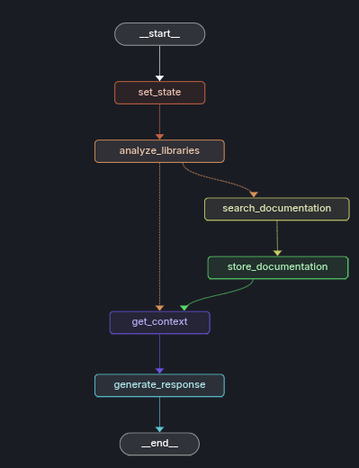

# AgentCoDoc: Make LLMs understand *YOUR* documentation

## Overview
Sometimes, LLMs don't really know what they are talking about. For LLM generated code, one of the big issue is that it hallucinates what library exists and which method is available.
Changes in different versions of the library you are using also makes things difficult. If the library or package is an internal one, forget any help without a RAG system.

**AgentCoDoc** aims to fill this gap. It’s an agentic Retrieval-Augmented Generation (RAG) system designed to dynamically ingest, parse, and contextualize niche or internal documentation—enabling more accurate and relevant LLM responses in developer-facing chat interfaces.

Use case: Internal teams working with proprietary SDKs, under-documented OSS tools, or edge-case libraries can leverage AgentCoDoc to enhance their dev assistants or chatbots, ensuring the model is grounded in the exact technical knowledge it needs.


## Live Demo
The LLM chat Interface app can be directly accessed at https://agentcodoc.streamlit.app/

## Features

- **Retrieval Augmented Generation (RAG)**:
    - Utilizes a vector database (SQLite with `SQLiteVec`) to store and search API documentation.
    - Embeddings are generated using OpenAI's `text-embedding-3-small` model.
    - Processes and chunks documents for retrieval.
    - The LLM verifies if the retrieved context is actually relevant to the query and filters out bad matches.
- **Dynamic Documentation Ingestion**:
    - Add API documentation from local files (`.md`, `.txt`, `.pdf`) during initialization.
    - Add documentation from URLs.
    - Automatically detects GitHub repository URLs and attempts to parse and ingest their `README.md` file.
    - An identifier agent tries to identify if a niche library is mentioned in the query or if it might be used. A search agent then retrieves best matching web-pages which are retrieved and stored.

## Under the hood

Key Python libraries used:
-   `streamlit`: For building the web interface.
-   `langchain`, `langgraph` and related packages: For LLM integration, RAG, and text processing.
-   `sqlite-vec`: For SQLite-based local vector storage.

### The Agentic flow



## Setup and Installation

1.  **Clone the repository (if applicable):**
    ```bash
    git clone <repository_url>
    cd <repository_name>
    ```

2.  **Install Dependencies:**
    This project uses Poetry for dependency management.
    ```bash
    poetry install
    ```
    If you don't have Poetry, you can install it by following the instructions on the [official Poetry website](https://python-poetry.org/docs/#installation).

3.  **Set up Environment Variables:**
    Create a `.env` file in the project root and add your API key: 
    ```
    OPENAI_API_KEY='your_openai_api_key_here'  # Required, OpenAI LLMs are used
    LANGSMITH_API_KEY='api_key_from_langchain'  # Optional, for langsmith
    LANGCHAIN_TRACING_V2=true
    TAVILY_API_KEY='tavily_search_api'  # Required, for search agent
    ```

4.  **Prepare Documentation (Optional):**
    Place your API documentation files (Markdown or text) in the `data/` directory. The application will automatically process these on first run if the database is empty.


## How to Run

Once dependencies are installed and your `.env` file is set up, run the Streamlit application from the project root directory:

```bash
streamlit run app.py
```

This will start the Streamlit server, and you can access the application in your web browser (usually at `http://localhost:8501`).

```bash
langgraph dev
```
This will start the langsmith api and the portal on which the graph execution and past traces can be viewed. (Optional)

## Usage

1.  **Adding Documentation (Optional):**
    -   The application will attempt to load any new `.md`, `.txt` or `.pdf` files from the `data/` directory (at the highest level) upon initialization.
    -   Upload a markdown, text or pdf file from the UI.
    -   Use the "Add Documentation from URL" feature in the UI to add a web page as documentation.
        -   If you provide a link to a GitHub repository, it will attempt to find and add the `README.md` file.
        -   Direct links to Markdown or text files are also supported.

2.  **Chatting with the API Assistant:**
    -   The library analysis agent will first identify if any niche libraries are mentioned in the query. If found, the web search agent will try to find documentation sources, and these will be added as documentation if not already existing.
    

## TODOs

-   Automated system tests
-   Add MCP server for integration with IDE copilots.
-   Verify already loaded documentation after analyzing query and before loading from web search agent.
